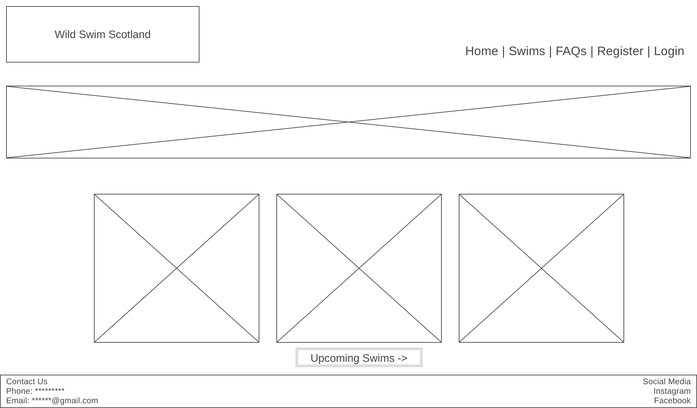

# Wild Swim Scotland

# Introduction

Wild Swim Scotland is a site for the staff members of Wild Swim Scotland to let their community know about the upcoming wild swims that are happening around Scotland, and for users to sign up for a swim, view their upcoming swims and connect with each other through reviews. 

The site is aimed at the wild swimming community of Scotland and hopes to help build a sense of community for these lovers of the cold!

[Live Site Here](https://wild-swim-scotland-47f727d45ac1.herokuapp.com/ "take you to the Wild Swim Deployed Page")

# Key Project Goals

The goals of the sites functionality are:

- List View: users can see all the swim cards, even if they have not registered or logged in
- Register: users can register to the site so that they can use the sites functionality 
- Logged In: users have the ability to join a swim and view their upcoming joined swims
- Logged Out: users are asked if they wish to sign out of the site
- Staff login: staff users can add new swims, read edit and delete the swims they have created from their staff account
- Reviews: users can write a review on the swim location to let other users know what their experience was, users can read, edit and delete the reviews they personally write from their account

# Agile Development

A Kaban board was used in GitHub to create the agile development process – see the board [here]( https://github.com/users/sarahgoodwin93/projects/3 "Kaban board for Wild Swim Scotland Project")

User stories were labelled using the MoSCoW method.

# User Experience

## Wireframes

Site structure was created before the site was created to test layout idea.
After testing UX a different approach was taken for better flow of the site navigation. 
Nav bar was moved to middle of page with clear call to actions.
Main image was removed to create focus on swim card images rather than a header iamge.
Logo was moved to middle of page to have more impact. 

## Database Schema

For this project the Django User Model was used for user account and two custom models with full CRUD were created for creating swims and leaving reviews. A third custom model was created for joining a swim, however due to the function of the site this does not have full CRUD as users can only edit and delete their joined swim, rather than create and update.

The data schema was created using [drawSQL](https://drawsql.app/ “drawsql website homepage”) before the project was started to get the flow and function of the models. Some of the fields in the below image do not reflect the final data types used (such as Cloudinary) – please see the app for the true data types. 

## Typography

The google font [Oswald](https://fonts.google.com/specimen/Oswald “oswald font”) was used throughout the site with different weights for different heading and paragraphs.

I chose this font for its tall height and wide proportions, making it a great choice for readability and also mimicking the swim cards height, making the site flow nicely. Oswald has rounded corners which give it a friendly appearance while still remaining bold and strong.  

## Colour Palette

I chose the colour #0d1a32 to remind people of the water and paired this with a white background for contrast and for a clean look and finish. As the swims will all have an image of a wild swim, either uploaded by the creator or using the default image, the blues in images from the water will match with #0d1a32 as the primary colour. 

## Design Choices

I wanted the design of the site to feel fresh and clean, just like how a wild swim makes you feel. I wanted the user experience to be easy to navigate and for the site to be very functional – users can come in, see the details they need, choose which swims to join and interact with each other. I did not want unnecessary detail about the swims as part of the fun of wild swimming is going into nature and letting that be your experience rather than overloading with information.

This is why I chose to display the swims as swim cards which have a very clean look.  

# Site Structure

# Features

## Existing Features

## The Landing page And General Site Content

The landing page of the site shows a non logged in / non registered user the upcoming swims and gives and explination of what Wild Swim Scotland is about. 
The text 
*Please see our upcoming swims, with times, dates and difficulty level.
Register an account with us and let us know your interest in joining a specific swim or 
leave a review on places you have been before.*
Gives users a clear indication on what the site offers them and what actions they should next perform.

It has 2 call to actions, Reigster and Login. 

The landing page is responsive for different screen sizes and scales down for easy mobile or tablet use. 

## Login

The login page welcomes the user back to the site and has 2 clear options, username and password.
The design is friendly and approacable by using rounded corners on the input boxes

The text at the bottom of the login section lets users know they must be logged into the site to use the full functions, it offers them an action if they have not yet registered by using the sign up link.

## Register

The register page welcomes users to the site with a friendly greeting. It lets users know that in order to use the site functions they must reigster an account.

It offers them space for a username, password and then rechecks the password to ensure it matches and there were no errors.

The text at the bottom lets users know who already have an account that they can sign in using the login page.

## User Permissions

## User Accounts

## Swims

## Register for Swims

## Future Features

# Technologies Used

## Testing

# Deployment

This project was developed using [Codeanywhere](https://app.codeanywhere.com/ "Link to Codeanywhere login"), which was then committed and pushed to GitHub using the Codeanywehere terminals.

## Deploying on GitHub Pages

To deploy this page to Heroku from its Codeanywhere repository, the following steps were taken:

1. Get Python Essentials Template from Code Institute [P3 Template](https://github.com/Code-Institute-Org/p3-template "p3 template link")
2. Create a new repository using the P3 template
3. Copy the repo URL and copy it into Codeanywhere to create a new workspace
4. Install Django - add to requirements file
5. Create Procfile and add guricorn
6. Log in to Heroku
7. Click 'New' - 'Create new app'
8. Enter a name for the application and select the region
9. Click 'Create App'
10. Go to Settings and connect to GitHub - choose the correct repository
11. Click 'Reveal config vars' and add DISABLE_COLLECTSTATIC as the key with a value of 1
12. Go to Deploy and scroll down, click on 'Deploy Branch' to manually deploy
13. Once the app has deployed, click 'Open App' at the top of the page

## Forking the Repository

## Cloning the Repository

## The ElephantSQL Database

# Credits

*Django models additional learning:*
- [Making queries](https://docs.djangoproject.com/en/5.0/topics/db/queries/ 'django documention for making queries')
To gain more understanding of making queries for my django modules this page was used, especially for the SwimPosts model.

- [Start Ratings for reviews](https://django-star-ratings.readthedocs.io/en/latest/?badge=latest/ 'how to use start ratings in django')
I wanted to encorporate star ratings in the review section of the site so this page was used to learn about star ratings in Django.

- [Django Validators](https://studygyaan.com/django/how-to-implement-validators-in-django-models?utm_content=cmp-true 'how to use django validators')
- [BuyBytes Youtube video on Validators](https://www.youtube.com/watch?v=1x0Zdukpjrs 'BugBytes youtube on Django ORM - Model Field Validators')
To add a 'swim difficulty' to the SwimPost model I used django validators and the above two sources were used to gain that understanding.

- [Date fields and timezones in Django](https://docs.djangoproject.com/en/5.0/topics/i18n/timezones/ 'django documentation on timezones')
To gain more understanding about date fields and how they work in django the above page was used.

- [User.is_authenticated](https://docs.djangoproject.com/en/5.0/ref/contrib/auth/ 'django documentation on django.contrib.auth')
To create the logout, upcoming swims and add swim pages, the above page was used to gain understtanding on how to add authenticated user sections.

*Django forms additonal learning:*
- [Editing an inbuilt django form](https://stackoverflow.com/questions/7769805/editing-django-form-as-p 'stack overflow on how to edit dajngo form')

- [Form Helper](https://django-crispy-forms.readthedocs.io/en/latest/crispy_tag_forms.html 'read-the-docs page on crispy forms')

*Django views additional learning:*
- [Editing Views](https://docs.djangoproject.com/en/5.0/ref/class-based-views/generic-editing/#django.views.generic.edit.DeleteView 'django docoumentation for editing views')
- [Code.my Youtube video using the DeleteView](https://www.youtube.com/watch?v=8NPOwmtupiI&t=580s 'code.my youtube video on deleting blog posts')
To gain more understanding of how to created CRUD functionality, these sources were used, especially for the AddSwimView, EditSwimView and DeleteSwimView

*Error Pages*
- [Adding Error Pages, 404 & 500](https://www.makeuseof.com/create-custom-404-error-page-django/ 'make use of us webpage')

# Acknoledgements
