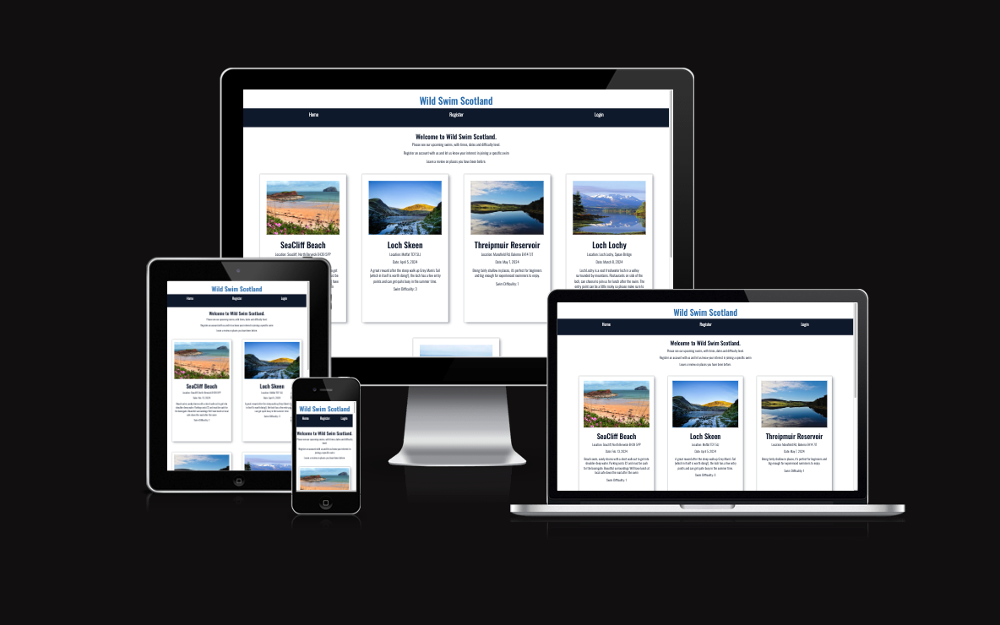
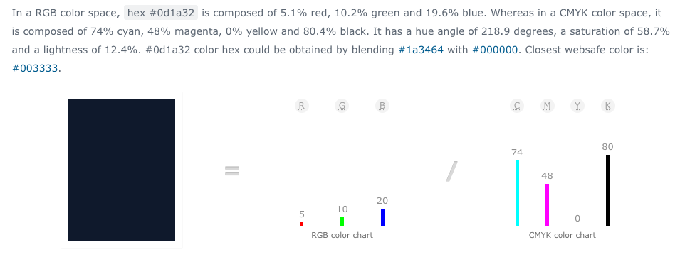
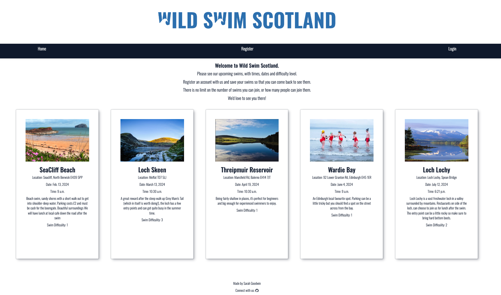
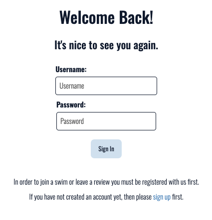
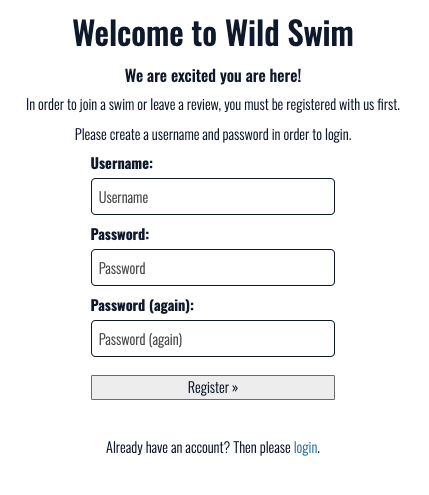
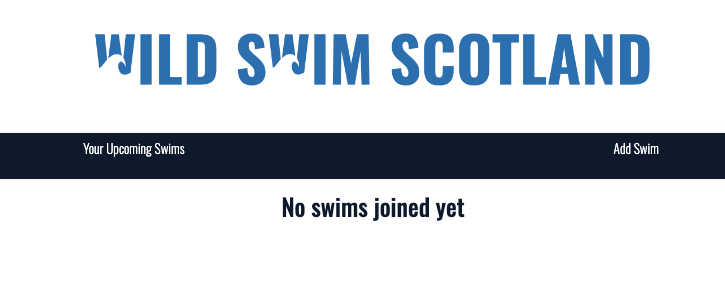
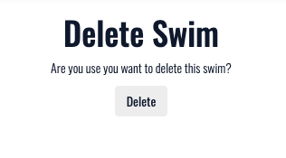

# Wild Swim Scotland

# Introduction

Wild Swim Scotland is a site for the community of wild swimmers within Scotland to connect and find out about upcoming swims they may wish to participate in. The staff users will post upcoming swims so that their community can join a swim, and site users can go back to the site to view their upcoming swims.

The site is aimed at all wild swimmers around Scotland and hopes to help build a sense of community for these lovers of the cold!

[Live Site Here](https://wild-swim-scotland-47f727d45ac1.herokuapp.com/ "take you to the Wild Swim Deployed Page")

# Table of Contents

- [Key Project Goals](#key-project-goals)
- [Agile Development](#agile-development)
- [User Experience](#user-experience)
    - [Wireframes](#wireframes)
    - [Database Schema](#database-schema)
    - [Typography](#typography)
    - [Colour Palette](#colour-palette)
    - [Logo](#logo)
    - [Design Choices](#design-choices)
- [Features](#features)
    - [Existing Features](#existing-features)
        - [Non logged in user](#non-logged-in-user)
            - [The Landing page And General Site Content](#the-landing-page-and-general-site-content)
            - [Login](#login)
            - [Register](#register)
        - [Logged in User](#logged-in-user)
            - [Logout](#logout)
            - [Your Upcoming Swims](#your-upcoming-swims)
        - [Staff User](#staff-user)
            - [Add Swim](#add-swim)
            - [Edit and Delete buttons](#edit-and-delete-buttons)
    - [Future Features](#future-features)
- [Technologies Used](#technologies-used)
- [Testing](#testing)
- [Deployment](#deployment)
    - [Deploying on GitHub Pages](#deploying-on-github-pages)
    - [The ElephantSQL Database](#the-elephantsql-database)
- [Credits](#credits)
    - [Content](#content)
        - [Images](#images)
    - [Education](#education)
- [Acknowledgements](#acknoledgements)

[Back to Top](#wild-swim-scotland)

# Key Project Goals

The goals of the sites functionality are:

- List View: users can see all the swim cards, even if they have not registered or logged in
- Register: users can register to the site so that they can use the sites functionality 
- Logged In: users have the ability to join a swim and view their upcoming joined swims
- Logged Out: users are asked if they wish to sign out of the site
- Staff login: staff users can add new swims, read edit and delete the swims they have created from their staff account

# Agile Development

A Kaban board was used in GitHub to create the agile development process – see the board [here]( https://github.com/users/sarahgoodwin93/projects/3 "Kaban board for Wild Swim Scotland Project")

User stories were labelled using the MoSCoW method.

[Back to Top](#wild-swim-scotland)

# User Experience

## Wireframes

Site structure was created before the site was created to test layout idea.
After testing UX a different approach was taken for better flow of the site navigation. 
Nav bar was moved to middle of page with clear call to actions.
Main image was removed to create focus on swim card images rather than a header iamge.
Logo was moved to middle of page to have more impact. 

## Database Schema

For this project the Django User Model was used for user account and one custom models with full CRUD were created for creating swims. A second custom model was created for joining a swim, however due to the function of the site this does not have full CRUD as users can only edit and delete their joined swim, rather than create and update.

Orginally there were plans to create a review model, however this feature was not fully developed and has been moved to future developmeants.

The data schema was created using [drawSQL](https://drawsql.app/ "drawsql website homepage") before the project was started to get the flow and function of the models. Some of the fields in the below image do not reflect the final data types used (such as Cloudinary) – please see the app for the true data types. 

## Typography

The google font [Oswald](https://fonts.google.com/specimen/Oswald/ "oswarld font") was used throughout the site with different weights for different heading and paragraphs.

I chose this font for its tall height and wide proportions, making it a great choice for readability and also mimicking the swim cards height, making the site flow nicely. Oswald has rounded corners which give it a friendly appearance while still remaining bold and strong.  

## Colour Palette

I chose the colour #0d1a32 to remind people of the water and paired this with a white background for contrast and for a clean look and finish. As the swims will all have an image of a wild swim, either uploaded by the creator or using the default image, the blues in images from the water will match with #0d1a32 as the primary colour. 

### Logo

The wild swim logo was created by Sarah Goodwin using Photoshop and the Oswald font. Waves were added to tie the site user back to the main purpose of the site, wild swimming.

## Design Choices

I wanted the design of the site to feel fresh and clean, just like how a wild swim makes you feel. I wanted the user experience to be easy to navigate and for the site to be very functional – users can come in, see the details they need, choose which swims to join and interact with each other. I did not want unnecessary detail about the swims as part of the fun of wild swimming is going into nature and letting that be your experience rather than overloading with information.

This is why I chose to display the swims as swim cards which have a very clean look.  

[Back to Top](#wild-swim-scotland)

# Features

## Existing Features

## Non-Logged in User

### The Landing page And General Site Content

The landing page of the site shows a non logged in / non registered user the upcoming swims and gives and explination of what Wild Swim Scotland is about. 
The text 
*Please see our upcoming swims, with times, dates and difficulty level.
Register an account with us and save your swims so that you can come back to see them.
There is no limit on the number of swims you can join, or how many people can join them.
We'd love to see you there!*
Gives users a clear indication on what the site offers them and what actions they should next perform.

It has 2 call to actions, Reigster and Login. 

The landing page is responsive for different screen sizes and scales down for easy mobile or tablet use. 

### Login

The login page welcomes the user back to the site and has 2 clear options, username and password.
The design is friendly and approacable by using rounded corners on the input boxes.

The text at the bottom of the login section lets users know they must be logged into the site to use the full functions, it offers them an action if they have not yet registered by using the sign up link.

If the username and password are not correct this error will show.

### Register

The register page welcomes users to the site with a friendly greeting. It lets users know that in order to use the site functions they must reigster an account.

It offers them space for a username, password and then rechecks the password to ensure it matches and there were no errors.

The text at the bottom lets users know who already have an account that they can sign in using the login page.

## Logged in User

### Logout

The logout page checks if the user does wish to sign out of the site.

### Your Upcoming Swims

The 'Your Upcoming Swims' page lets users know what swims they have joined previously and allows them to remove swims from their swim list. 

If the user has not yet joined an upcoming swim they will see the message "No swims joined yet"

## Staff User

### Add Swim

The add swim page allows staff users to add new swism to the swim list. If they have not provided an image for their swim, the placeholder image will be added for them.
The Add Swim page has warnings for both the date, time and swim difficulty fields if they are not entered correctly.
To prevent users from entering the date in the wrong format the YYYY-MM-DD text has been added.
To prevent users from enterting the time in the wrong formate the 00:00:00 text has been added.
to prevent users from entering the swim difficulty incorrectly the 1-5 text has been added.
If the above fields are not entered correctly a warning will show.

## Edit and Delete buttons

The edit and delete buttons only appear to a swim that the specific staff user has added, they cannot edit or delete swims other staff members have created.

When clicking on the edit swim button the form has the same functions as the add swim form, however the swim details are already populated so that the staff user can edit them according. The same error warning functions as the add swim form.

When clicking the delete swim buttton the user is asked if they are sure they want to delete the swim before the action is performed. 

## Future Features

There are some future features that I would like to add to the project to improve user functions.

- Reviews
I began to create the review function of the site, where users could come in and add reviews for different swim locations so that others could make a more informed decision on if they wanted to join a particular swim.

- Community Board
It would be good to have a community board for wild swimmers to chat to each other and post stories and photos from their swims and connect together

- Date Picker
Currently the date picker allows staff users to pick any date, a future implimentation would be to restrict the date picker to only have future dates

- Past Swims
A section of the community page where past swims would automatically go after their date was passed so users could see what type of swims they had done previously

- Joined Swims saved to staff dashboard
In the future I would like to have the join swim button log which user has joined which swim and have a staff dashboard area so that staff users could see how many people had signed up to that particular swim. 

[Back to Top](#wild-swim-scotland)

# Technologies Used

- [Lucidchart](https://www.lucidchart.com/ "link to Lucidchart homepage")
Lucidchart was used to create the wireframe in the planning stages of the project
- [drawSQL](https://drawsql.app/ “drawsql website homepage”)
Drawsql was used to create the data schema
- [HTML5](https://en.wikipedia.org/wiki/HTML5 "link to html5 wikipedia")
Used to create structure and content for the site.
- [CSS](https://www.w3.org/Style/CSS/Overview.en.html "link to w3")
Used to add custom styles to the site.
- [Django](https://www.djangoproject.com/ "link to django docs homepage")
The python framework used to develop the site.
- [Bootstrap](https://getbootstrap.com/ "link to bootstrap homepage")
The CSS framework used to add styles and structure to the site.
- [Python](https://en.wikipedia.org/wiki/Python_(programming_language) "link to Python wikipedia")
Used to provide functionality to the site.
- [Cloudinary](https://cloudinary.com/ "link to cloudinary homepage")
Used to host images for the swim cards
- [ElephantSQL](https://www.elephantsql.com/ "link to elephantsql homepage")
Used to host the database used for the site.
- [Am I Responsive?](https://ui.dev/amiresponsive "Link to Am I responsive webpage")
Am I Responsive was used to see the responsive design and create screenshots of the final page on different devices.
- [Codeanywhere](https://app.codeanywhere.com/ "Link to Codeanywhere webpage")
Codeanywhere was used for writing code, adding, committing and pushing to GitHub before issues were faced and moved to GitPod.
- [Gitpod](https://www.gitpod.io/#get-started "Link to gitpod webpage")
Used to continue to create code and file structure for the respository.
- [GitHub](https://github.com/ "Link to github webpage")
GitHub was used to store the code files, README files and asset files after pushing
- [Heroku](https://id.heroku.com/login "Link to Heroku login")
Heroku was used to deploy the project. 

## Testing

Testing detail can be found [here](TESTING.md)

# Deployment

This project was developed using [Codeanywhere](https://app.codeanywhere.com/ "Link to Codeanywhere login") at the start until issues with codeanywhere occured. It was committed and pushed to GitHub using the Codeanywehere terminals.
After the issues with codeanywhere the project was moved to [GitPod](https://www.gitpod.io/ "link to gitpod homepage") and continuted from there. The projected had deployed at the start so the following is a step by step of how it was first deployed.

## Cloning The Repository

To clone the repository using GitHub the following steps were taken:

1. In the repository, select the "code" tab.
2. Select "HTTPS" in the dropdown menu.
3. Click the 'copy URL to dashboard button.
4. Open your chosen IDE
5. Create a new workspace and paste in the copied URL
6. Press enter

## Deploying on GitHub Pages

To deploy this page to Heroku from its Codeanywhere repository, the following steps were taken:

1. Get Python Essentials Template from Code Institute [P3 Template](https://github.com/Code-Institute-Org/p3-template "p3 template link")
2. Create a new repository using the P3 template
3. Copy the repo URL and copy it into Codeanywhere to create a new workspace
4. Install Django - add to requirements file
5. Create Procfile and add guricorn
6. Log in to Heroku
7. Click 'New' - 'Create new app'
8. Enter a name for the application and select the region
9. Click 'Create App'
10. Go to Settings and connect to GitHub - choose the correct repository
11. Click 'Reveal config vars' and add DISABLE_COLLECTSTATIC as the key with a value of 1
12. Go to Deploy and scroll down, click on 'Deploy Branch' to manually deploy
13. Once the app has deployed, click 'Open App' at the top of the page

## The ElephantSQL Database
ElephantSQL PostgreSQL Database was used for this project, to set up a database the following steps were taken:

1. Sign up or log in to ElephantSQL with your GitHub account.
2. Click on "Create New Instance".
3. Enter a name for the instance
4. Select "Tiny Turtle (Free)" free plan.
5. Click "Select Region".
6. Select a data center near you.
7. Click "Review".
8. Ensure that all details are correct and then click "Create instance".
9. Copy the database URL
10. Add the database into the setting.py file

You will also need to add the database to your Django settings.py file:

DATABASES = {

'default': dj_database_url.parse(os.environ.get("DATABASE_URL"))

}

[Back to Top](#wild-swim-scotland)

# Credits

## Content

Wording for the site was all created by Sarah Goodwin

### Images

Images for swim posts were taken from google images of the swim location.
The logo image was created by Sarah Goodwin on Photoshop

## Education

*Django models additional learning:*
- [Making queries](https://docs.djangoproject.com/en/5.0/topics/db/queries/ 'django documention for making queries')
To gain more understanding of making queries for my django modules this page was used, especially for the SwimPosts model.

- [Start Ratings for reviews](https://django-star-ratings.readthedocs.io/en/latest/?badge=latest/ 'how to use start ratings in django')
I wanted to encorporate star ratings in the review section of the site so this page was used to learn about star ratings in Django. This has been kept in for future implimentation

- [Django Validators](https://studygyaan.com/django/how-to-implement-validators-in-django-models?utm_content=cmp-true 'how to use django validators')
- [BuyBytes Youtube video on Validators](https://www.youtube.com/watch?v=1x0Zdukpjrs 'BugBytes youtube on Django ORM - Model Field Validators')
To add a 'swim difficulty' to the SwimPost model I used django validators and the above two sources were used to gain that understanding.

- [Date fields and timezones in Django](https://docs.djangoproject.com/en/5.0/topics/i18n/timezones/ 'django documentation on timezones')
To gain more understanding about date fields and how they work in django the above page was used.

- [User.is_authenticated](https://docs.djangoproject.com/en/5.0/ref/contrib/auth/ 'django documentation on django.contrib.auth')
To create the logout, upcoming swims and add swim pages, the above page was used to gain understtanding on how to add authenticated user sections.

*Django forms additonal learning:*
- [Editing an inbuilt django form](https://stackoverflow.com/questions/7769805/editing-django-form-as-p 'stack overflow on how to edit dajngo form')

- [Form Helper](https://django-crispy-forms.readthedocs.io/en/latest/crispy_tag_forms.html 'read-the-docs page on crispy forms')

- [Date Picker](https://www.letscodemore.com/blog/how-to-add-date-input-widget-in-django-forms/#:~:text=In%20this%20case%2C%20we%20are,is%20rendered%20in%20the%20template. 'letscodemore date widget page')
To gain more understanding of how to add a date picker widget this site was used

*Django views additional learning:*
- [Editing Views](https://docs.djangoproject.com/en/5.0/ref/class-based-views/generic-editing/#django.views.generic.edit.DeleteView 'django docoumentation for editing views')
- [Code.my Youtube video using the DeleteView](https://www.youtube.com/watch?v=8NPOwmtupiI&t=580s 'code.my youtube video on deleting blog posts')
To gain more understanding of how to created CRUD functionality, these sources were used, especially for the AddSwimView, EditSwimView and DeleteSwimView
- [Restrict access via url](https://docs.djangoproject.com/en/5.0/topics/auth/default/ "Using the Django authentication system")

*Error Pages*
- [Adding Error Pages, 404 & 500](https://www.makeuseof.com/create-custom-404-error-page-django/ 'make use of us webpage')

*Additional Education*
- [Stack Overflow](https://stackoverflow.com/ "Link to Stack Overflow webpage")
Stack overflow was used to answer questions as to why certain code may not be performing as expected.

- [ChatGPT](https://openai.com/blog/chatgpt "link to chatgpt page")
  ChatGPT was used gain a better understanding of errors faced

- [CluelessBiker/mentoring](https://github.com/CluelessBiker/mentoring "link to CluesslessBiker repo")
  CluelessBiker mentoring github page was used to check examples of projects, access links to resources such as validators and w3schools, Am I Responsive.

# Acknowledgements

- Mentor, Lauren-Nicole, for all her help and support, the useful resources she provided and for being a friendly face throughout! Could not have done this project without her!!
- Friends and family who helped test the site on different devices and give real world user feedback

[Back to Top](#wild-swim-scotland)
